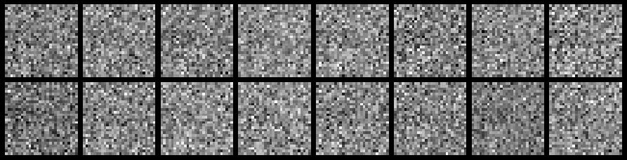

One of the biggest challenges of deep learning is figuring out how to use artificial intelligence to generate data like picture, video, text, and sound. In 2010, Ian Goodfellow published a paper popularizing a technique knowing as generative adversarial networks (GAN). To explain how it works, we can think of the technique as 2 people, a forger and an art detective, competing against each other. The forger will try to created forged paintings, and the detective will try to spot the fakes. As the detective spots more and more fakes, she will get better at finding the forged works. Likewise, as the forger sees how the detective is spotting his fake, he will get better and better at making the forgeries. This will go back and forth until us normal humans won't be able to tell the difference between the reals and fakes. 

In technical terms, it uses a convolutional neural network, called a discriminator network, to identify fakes and a dense neural network to create the images. Both networks start out untrained, and the convolutional network is trained every epoch on a labeled real and fake image. For the generative network, the output of the discriminator on a fake image is set the target to one (as if it was a real image) and the error is passed back through the discriminator and into the generative network to be used as error values for backpropagation

These networks can produce incredibly realistic images such as the images produced by researchers at Nvidia. This technique is a standard method to generate realistic looking data, so it is a given that any hopeful AI engineer should know this.

Due to its incredible power, I used Diego Mosquera's tutorial on constructing a GAN to guide me through the process. The GAN I created uses the famous MNIST data set of handwritten numbers as a reference to generate images. This is a small subset of the training examples

This was the network's first try.

Once training was complete the network was performing remarkably well.

As you can see, the generated numbers do closely resemble the data set and with a graphics card, I could run a larger network that could even replicate the data even further. However, I am very happy with my progress as the GAN learned to create realistic hand-drawn numbers. I plan on trying to generate faces once I upgrade my hardware. 

